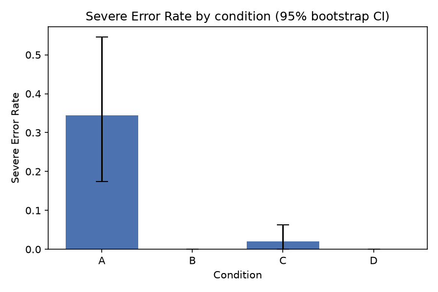
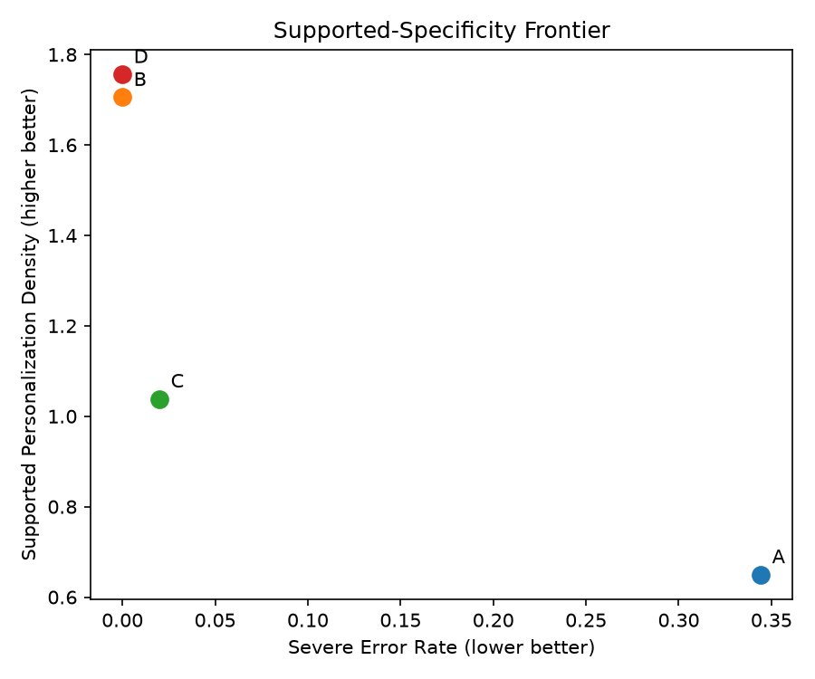

# Recipient-Focused Hallucinations in AI-Generated Professor Outreach Emails

**A factorial study of whether grounding and verification stop LLMs from misrepresenting a real researcher's work.**

*NSRI Summer Research Hackathon 2026 — Technology & AI track. Offline benchmark; **no email is ever sent.***

---

## TL;DR

When an LLM writes a "personalised" outreach email to a professor **without seeing their
publications, it fabricates research claims about them 34% of the time** (≥1 fabricated or
unsupported claim in **45% of emails**). Giving the model the professor's real papers before
it writes (**grounding**) drops the severe-error rate to **0%** *and doubles* how specific and
useful the email is. Grounding also beats fixing the draft afterward (verification).

We measured this at the **claim level** — every atomic statement an email makes about a
professor is checked against their publication record — across **96 emails, 360 claims, 12
professors, 3 fields**, with a human-validated subset confirming the automatic labels
*understate* the problem.

## Headline results

| Condition | Severe Error Rate (auto) | Severe Error Rate (human subset) | Supported Personalization Density |
|-----------|--------------------------|----------------------------------|-----------------------------------|
| **A** — closed-book (no evidence) | 0.34 | **0.64** | 0.65 |
| **B** — grounded (evidence to writer) | **0.00** | **0.00** | 1.71 |
| **C** — verify-only (fix after) | 0.02 | 0.00 | 1.04 |
| **D** — grounded + verified | **0.00** | **0.00** | 1.76 |

*Severe Error Rate = (unsupported + contradicted) / judged factual claims. Supported
Personalization Density (SPD) = supported research-specific claims per 100 words.*



**Figure 1.** Severe Error Rate by condition, with 95% bootstrap confidence intervals.



**Figure 2.** The Supported-Specificity Frontier. Best is upper-left (low error, high
specificity). Closed-book (A) sits lower-right; grounded (B, D) sit upper-left.

### Key findings
- **Grounding removes fabrication** — severe errors fell from 0.34 to 0.00, with no loss of
  specificity (SPD rose 0.65 → 1.71).
- **Grounding beats verification** (B vs C) on *both* factuality and specificity: evidence at
  write time is more effective than post-hoc repair, which achieves safety partly by deleting
  content (C deleted 55% of edited claims vs D's 25%).
- **Automatic error rates are conservative** — a human annotator found *more* errors than the
  LLM judge (closed-book SER 0.64 vs 0.34), so the true gap is at least as large as reported.

## The 2×2 experimental design

| Condition | Writer receives evidence | Post-generation verification | Purpose |
|-----------|--------------------------|------------------------------|---------|
| **A** | No | No | Closed-book baseline (the audit target) |
| **B** | Yes | No | Effect of grounding during writing |
| **C** | No | Yes | Effect of correction after ungrounded writing |
| **D** | Yes | Yes | Combined safeguards |

One writer prompt, identical across conditions except the evidence block. Evidence packets are
built from **OpenAlex** (public scholarly metadata). Each claim is labelled *supported,
partially supported, overstated, unsupported, contradicted, outside evidence scope,* or
*subjective/generic* against the packet.

## How it works

```
ingest (OpenAlex)  →  evidence packet per professor
      │
      ▼
generate (4 conditions)  →  verify (C/D, minimal-edit)  →  extract atomic claims
      │
      ▼
auto-evaluate (LLM judge)  →  metrics + figures  ←  human validation (subset)
```

**Cross-family by design:** the writer (OpenAI `gpt-4o-mini`) is a different model family
than the verifier (`claude-haiku-4.5`) and the judge/extractor (`claude-3-haiku`), so no model
grades its own family. Every run logs model, provider, prompt version, seed, and temperature.

## Reproduce

```bash
# 1. Install (Python ≥ 3.11)
pip install -e ".[dev,analysis]"

# 2. Offline smoke test — no API key, mock provider
python scripts/run_pilot.py --config config/config.yaml --dry-run
pytest -q                                  # 259 tests

# 3. Real run — set one key, then generate (via OpenRouter, ~$1 for 96 emails)
echo "OPENROUTER_API_KEY=sk-or-..." >> .env
python scripts/run_pilot.py --config config/config.full-openrouter.yaml --out outputs/full.jsonl

# 4. Blind the claims, auto-evaluate, and compute results + figures
python scripts/build_annotation_batch.py --inputs outputs/full.jsonl --evidence-dir data/evidence
python scripts/auto_evaluate.py     --outputs outputs/full.jsonl --blinding-map annotations/blinding_map.csv
python scripts/compute_results.py   --outputs outputs/full.jsonl --labels annotations/machine_labels.csv --blinding-map annotations/blinding_map.csv

# 5. Human validation (real annotator) + agreement vs the auto-evaluator
python scripts/human_check.py build           # produces a fillable sheet
#   (a human fills labels) then:
python scripts/human_check.py parse
python scripts/validate_evaluator.py --machine annotations/machine_labels.csv --human annotations/human_labels.csv
```

## Repository map

| Path | What it is |
|------|-----------|
| `paper/FINAL_paper.md` | The complete manuscript (results, figures, references) |
| `src/outreach_eval/` | Python package: schemas, LLM adapters, generation, verification, metrics |
| `scripts/` | `run_pilot`, `auto_evaluate`, `compute_results`, `validate_evaluator`, `build_annotation_batch`, `human_check`, `validate_packet`, + OpenAlex collection stages |
| `config/` | Run configs (mock, OpenRouter pilot, full run) |
| `prompts/` | Versioned writer / verifier / claim-extractor prompts |
| `data/evidence/` | Per-professor evidence packets (**anonymised**; real names withheld) |
| `analysis/` | `results.csv`, `human_validation.csv`, `inter_evaluator_agreement.csv`, `figures/` |
| `annotations/` | Rubric, blinded claim sheet, machine + human labels |
| `docs/` | Research proposal, experimental design, analysis plan, rubric, decision log, verification report |
| `tests/` | 259 tests (mock provider; no network) |

## Evaluation & validation

- **Primary metrics:** Severe Error Rate (SER) and Supported Personalization Density (SPD),
  with 95% bootstrap CIs — see `docs/analysis_plan.md`.
- **Automatic evaluator:** an LLM judge labels all 360 claims (`annotations/machine_labels.csv`).
- **Human validation:** a blinded 36-claim subset, human-labelled (`annotations/human_labels.csv`);
  auto-vs-human Cohen's κ = 0.33 (`analysis/human_validation.csv`) — the judge is reliable on
  *supported* claims but under-detects errors, so reported rates are a **lower bound**.
- **Inter-evaluator robustness:** a second judge from a third model family, κ = 0.50
  (`analysis/inter_evaluator_agreement.csv`).

## Ethics & anonymisation

- Only public scholarly metadata (OpenAlex) is used; **no emails are sent**.
- All professors appear as anonymous IDs (`CS-01`, `PSY-01`, `BIO-01`, …). Evidence packets in
  this repo are anonymised; the real-name mapping is withheld (never committed).
- Because closed-book outputs can fabricate claims about real people, generated emails and
  annotations are anonymised so no fabricated statement is publicly tied to a real name.

## Team & workstreams

| # | Workstream | Owner |
|---|-----------|-------|
| 1 | Dataset & evidence packets | Phong Cao |
| 2 | Generation & verification pipeline | Abhinav Singh |
| 3 | Annotation & evaluation | Kanan |
| 4 | Related work & paper | Azhdar Mammadov |

**Full paper:** [`paper/FINAL_paper.md`](paper/FINAL_paper.md) · **Design & decisions:**
[`docs/experimental_design.md`](docs/experimental_design.md), [`docs/decision_log.md`](docs/decision_log.md)
· **Contributor guide:** [`CLAUDE.md`](CLAUDE.md)

> **Limitations (pilot).** 12 professors, English-only; a single writer model; provisional
> evidence packets (abstracts + abstract-excerpt passages); human validation on a 36-claim
> subset. The direction of every result is robust; exact magnitudes are pilot-scale estimates.
