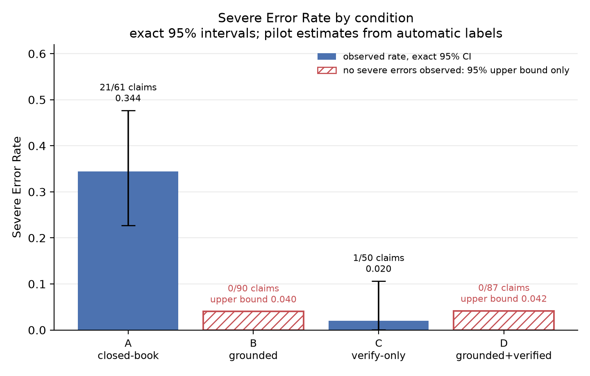
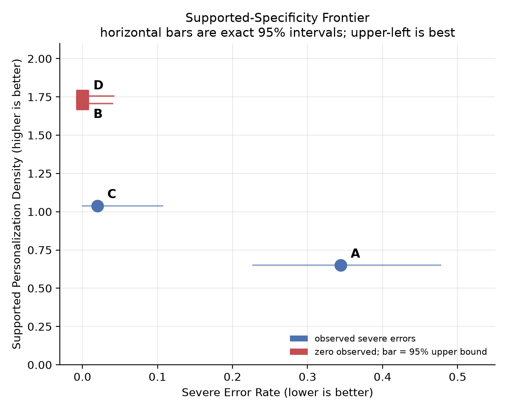
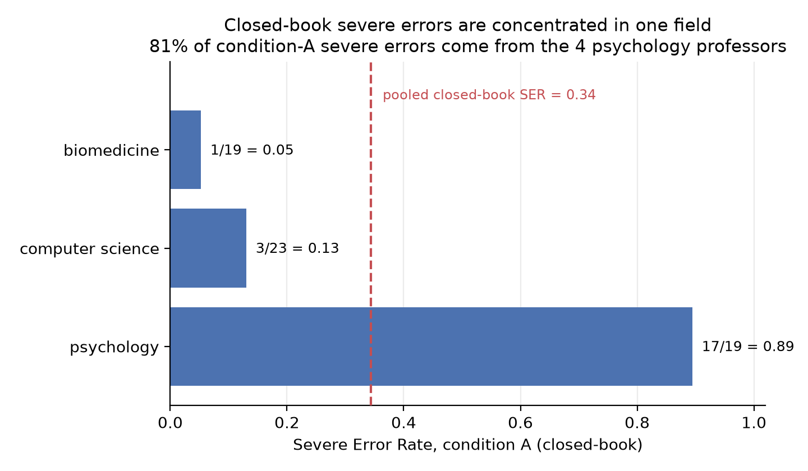

# Recipient-Focused Hallucinations in AI-Generated Professor Outreach Emails

**A factorial study of whether grounding and verification stop LLMs from misrepresenting a real researcher's work.**

*NSRI Summer Research Hackathon 2026 — Technology & AI track. Offline benchmark; **no email is ever sent.***

---

> **Status: revision 1 for the NSRI Student Research Journal** (submission NSRI-J-2026-0178).
> The manuscript under review is
> [`paper/REVISED_paper_NSRI-J-2026-0178.md`](paper/REVISED_paper_NSRI-J-2026-0178.md); the
> point-by-point editor response is
> [`paper/REVISION_RESPONSE.md`](paper/REVISION_RESPONSE.md).
> **All rates below are pilot estimates from automatic (LLM) labels and are
> instrument-relative — read the caveats before quoting any number.**

## TL;DR

When an LLM writes a "personalised" outreach email to a professor **without seeing their
publications, it makes unsupported research claims about them at a rate of 0.34–0.46**
depending on which evaluator you ask, and 0.64 on a small human-labelled subset. Giving the
model the professor's real papers before it writes (**grounding**) cuts that sharply — to
**0.00** under our primary automatic evaluator and **0.11** under a second one — *and* roughly
doubles how specific and useful the email is. Grounding also beats fixing the draft afterward
(verification), under both evaluators.

We measured this at the **claim level** — every atomic statement an email makes about a
professor is checked against their publication record — across **96 emails, 360 claims, 12
professors, 3 fields**.

## Headline results

| Condition | SER — primary evaluator | SER — second evaluator | SER — human subset | SPD |
|-----------|-------------------------|------------------------|--------------------|-----|
| **A** — closed-book (no evidence) | 0.344 (21/61) | 0.455 (35/77) | **0.636** (7/11) | 0.65 |
| **B** — grounded (evidence to writer) | **0.000** (0/90) | 0.106 (10/94) | 0.000 (0/10) | 1.71 |
| **C** — verify-only (fix after) | 0.020 (1/50) | 0.204 (11/54) | 0.000 (0/3) | 1.04 |
| **D** — grounded + verified | **0.000** (0/87) | 0.044 (4/90) | 0.000 (0/3) | 1.76 |

*Severe Error Rate (SER) = (unsupported + contradicted) / judged factual claims. Supported
Personalization Density (SPD) = supported research-specific claims per 100 words. Exact
(Clopper–Pearson) intervals for every cell are in [`analysis/revision/`](analysis/revision/).*



**Figure 1.** Severe Error Rate by condition (primary evaluator), with exact 95% intervals.
Hatched bars mark conditions where **no severe error was observed** — the bar height is the
95% *upper bound*, not a measured rate.



**Figure 2.** The Supported-Specificity Frontier. Best is upper-left (low error, high
specificity). Closed-book (A) sits lower-right; grounded (B, D) sit upper-left.



**Figure 3.** The closed-book rate is **not** homogeneous: 81% of its severe errors come from
the four psychology professors.

### Key findings
- **Grounding sharply reduces fabrication with no loss of specificity** — severe errors fell
  from 0.344 to 0.000 (primary evaluator) or 0.455 to 0.106 (second evaluator), while SPD rose
  0.65 → 1.71.
- **Grounding beats verification** (B vs C) on *both* factuality and specificity, **under both
  evaluators**: evidence at write time beats post-hoc repair, which achieves safety partly by
  deleting content (C deleted 55% of edit decisions vs D's 25%, Fisher p = 0.0025). This is
  the study's best-supported claim.
- **Automatic error rates understate the problem** — the human annotator found *more* errors
  than the LLM judge (closed-book 0.64 vs 0.34), and did so one-directionally (judge too
  lenient in 14 of 16 disagreements, too strict in 0).

### Caveats — read before quoting a number
- **The primary evaluator is not a validated instrument.** Agreement with the human annotator
  is only *fair*: Cohen's κ = 0.33 (95% CI 0.16–0.49), entirely below the conventional κ ≥ 0.6
  bar. Human labelling covers 36 of 360 claims (10%), with just 3 judged factual claims each
  in conditions C and D (condition D's from a single email).
- **The zeros are judge-specific, not a property of the emails.** A second evaluator from a
  third model family finds 10 severe errors in condition B and 4 in D. Read 0.00 as "below
  this instrument's detection threshold", not as elimination. The B/D zeros are consistent
  with true rates up to ~0.04 (claim level) or ~0.14 (email level).
- **The closed-book rate is driven by one field.** Excluding psychology it falls from 0.344 to
  0.095. Five of the twelve professors produced no severe errors even closed-book.
- **The `overstated` label was never emitted** by either automatic evaluator on any of the 360
  claims, so the pre-specified overstatement-rate metric was structurally zero and is withdrawn.
- **SPD is inflated by roughly a third** — of the 24 claims the judge called *supported*, only
  16 were human-supported (precision 0.67, 95% CI 0.47–0.83). Condition ordering is preserved.
- **In C and D the verifier and the evaluator are both Anthropic models**, so those two
  conditions carry a same-family confound. Condition B, which carries the central claim, does not.

Regenerate every number and figure above:

```bash
python scripts/compute_revision_stats.py   # tables  -> analysis/revision/
python scripts/make_revision_figures.py    # figures -> analysis/figures/
python scripts/build_submission_docx.py    # NSRI-compliant .docx -> paper/
```

## The 2×2 experimental design

| Condition | Writer receives evidence | Post-generation verification | Purpose |
|-----------|--------------------------|------------------------------|---------|
| **A** | No | No | Closed-book baseline (the audit target) |
| **B** | Yes | No | Effect of grounding during writing |
| **C** | No | Yes | Effect of correction after ungrounded writing |
| **D** | Yes | Yes | Combined safeguards |

One writer prompt, identical across conditions except the evidence block. Evidence packets are
built from **OpenAlex** (public scholarly metadata). Each claim is labelled *supported,
partially supported, overstated, unsupported, contradicted, outside evidence scope,* or
*subjective/generic* against the packet.

## How it works

```
ingest (OpenAlex)  →  evidence packet per professor
      │
      ▼
generate (4 conditions)  →  verify (C/D, minimal-edit)  →  extract atomic claims
      │
      ▼
auto-evaluate (LLM judge)  →  metrics + figures  ←  human validation (subset)
```

**Cross-family, partially:** the writer (OpenAI `gpt-4o-mini`) is a different model family
from the judge/extractor (`claude-3-haiku`), so the writer's text is never graded by its own
family. **This does not hold in conditions C and D**, where the verifier (`claude-haiku-4.5`)
and the judge are both Anthropic models — text edited by one Anthropic model is graded by
another. Condition B, which carries the central grounding claim, uses no verifier and is
unaffected; the second evaluator (`gemini-2.5-flash-lite`) is a third family and provides the
cross-check. Every run logs model, provider, prompt version, seed, and temperature.

## Reproduce

```bash
# 1. Install (Python ≥ 3.11)
pip install -e ".[dev,analysis]"

# 2. Offline smoke test — no API key, mock provider
python scripts/run_pilot.py --config config/config.yaml --dry-run
pytest -q                                  # 259 tests

# 3. Real run — set one key, then generate (via OpenRouter, ~$1 for 96 emails)
echo "OPENROUTER_API_KEY=sk-or-..." >> .env
python scripts/run_pilot.py --config config/config.full-openrouter.yaml --out outputs/full.jsonl

# 4. Blind the claims, auto-evaluate, and compute results + figures
python scripts/build_annotation_batch.py --inputs outputs/full.jsonl --evidence-dir data/evidence
python scripts/auto_evaluate.py     --outputs outputs/full.jsonl --blinding-map annotations/blinding_map.csv
python scripts/compute_results.py   --outputs outputs/full.jsonl --labels annotations/machine_labels.csv --blinding-map annotations/blinding_map.csv

# 5. Human validation (real annotator) + agreement vs the auto-evaluator
python scripts/human_check.py build           # produces a fillable sheet
#   (a human fills labels) then:
python scripts/human_check.py parse
python scripts/validate_evaluator.py --machine annotations/machine_labels.csv --human annotations/human_labels.csv
```

## Repository map

| Path | What it is |
|------|-----------|
| `paper/REVISED_paper_NSRI-J-2026-0178.md` | **The manuscript under review** (revision 1, 4798 words) |
| `paper/NSRI-J-2026-0178_revision1.docx` | **The submission file** — NSRI-compliant: double spaced, Times New Roman 12pt, continuous line numbering |
| `paper/archive/` | Longer 6393-word draft of the revision, before the length cut |
| `paper/REVISION_RESPONSE.md` | Point-by-point response to the NSRI editorial decision |
| `paper/FINAL_paper.md` | The originally submitted manuscript (superseded) |
| `src/outreach_eval/` | Python package: schemas, LLM adapters, generation, verification, metrics |
| `scripts/` | `run_pilot`, `auto_evaluate`, `compute_results`, `compute_revision_stats`, `make_revision_figures`, `build_submission_docx`, `validate_evaluator`, `build_annotation_batch`, `human_check`, `validate_packet`, + OpenAlex collection stages |
| `config/` | Run configs (mock, OpenRouter pilot, full run) |
| `prompts/` | Versioned writer / verifier / claim-extractor prompts |
| `data/evidence/` | Per-professor evidence packets (**anonymised**; real names withheld) |
| *not released* | **Generated email texts** and the identity map. Closed-book drafts name real researchers and contain fabricated claims about them; releasing them would de-anonymise the sample. Every table reproduces without them via `analysis/revision/run_metadata.csv`. |
| `analysis/` | `results.csv`, `human_validation.csv`, `inter_evaluator_agreement.csv`, `figures/` |
| `analysis/revision/` | Revision statistics: exact intervals, both-evaluator rates, confusion matrix, per-field/per-professor breakdowns, de-identified `run_metadata.csv`, `report.md` |
| `annotations/` | Rubric, blinded claim sheet, machine + human labels |
| `docs/` | Research proposal, experimental design, analysis plan, rubric, decision log, verification report |
| `tests/` | 259 tests (mock provider; no network) |

## Evaluation & validation

- **Primary metrics:** Severe Error Rate (SER) and Supported Personalization Density (SPD),
  with 95% bootstrap CIs — see `docs/analysis_plan.md`.
- **Automatic evaluator:** an LLM judge labels all 360 claims (`annotations/machine_labels.csv`).
- **Human validation:** a blinded 36-claim subset, human-labelled (`annotations/human_labels.csv`);
  auto-vs-human Cohen's κ = 0.33 (`analysis/human_validation.csv`) — the judge is reliable on
  *supported* claims but under-detects errors, so reported rates are a **lower bound**.
- **Inter-evaluator robustness:** a second judge from a third model family, κ = 0.50
  (`analysis/inter_evaluator_agreement.csv`).

## Ethics & anonymisation

- Only public scholarly metadata (OpenAlex) is used; **no emails are sent**.
- All professors appear as anonymous IDs (`CS-01`, `PSY-01`, `BIO-01`, …). Evidence packets in
  this repo are anonymised; the real-name mapping is withheld (never committed).
- Because closed-book outputs can fabricate claims about real people, generated emails and
  annotations are anonymised so no fabricated statement is publicly tied to a real name.

## Team & workstreams

| # | Workstream | Owner |
|---|-----------|-------|
| 1 | Dataset & evidence packets | Phong Cao |
| 2 | Generation & verification pipeline | Abhinav Singh |
| 3 | Annotation & evaluation | Kanan |
| 4 | Related work & paper | Azhdar Mammadov |

**Full paper:** [`paper/REVISED_paper_NSRI-J-2026-0178.md`](paper/REVISED_paper_NSRI-J-2026-0178.md) · **Editor response:** [`paper/REVISION_RESPONSE.md`](paper/REVISION_RESPONSE.md) · **Design & decisions:**
[`docs/experimental_design.md`](docs/experimental_design.md), [`docs/decision_log.md`](docs/decision_log.md)
· **Contributor guide:** [`CLAUDE.md`](CLAUDE.md)

## Acknowledgements

Built for the **NSRI Summer Research Hackathon 2026**, Technology & AI track. We thank the
organisers and the track sponsors, **ColdMatch** and **Quanticle**, whose focus on AI-assisted
academic outreach and research insight motivated this study's problem setting. The sponsors
provided no funding and had no role in the design, execution, or reporting of this work.

> **Limitations (pilot).** 12 professors, English-only; a single writer model; provisional
> evidence packets (abstracts + abstract-excerpt passages); human validation on a 36-claim
> subset. The direction of every result is robust; exact magnitudes are pilot-scale estimates.
